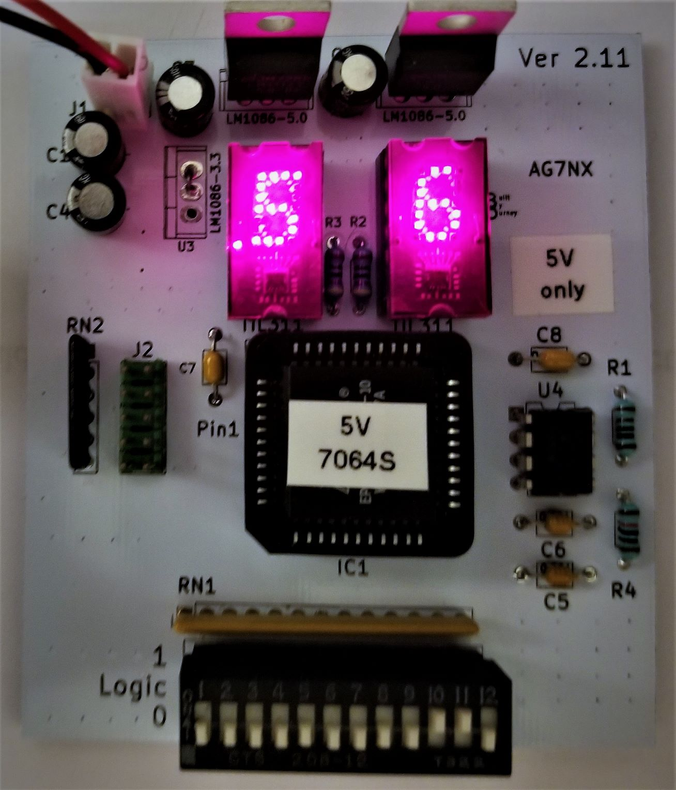
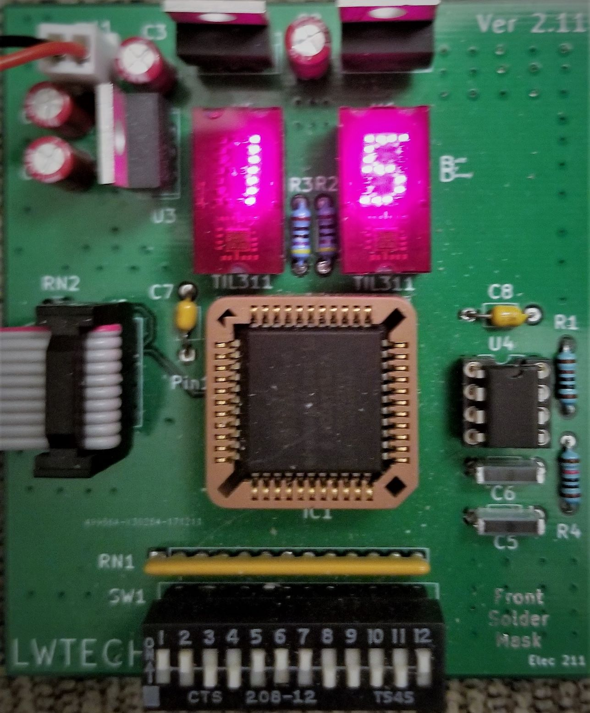
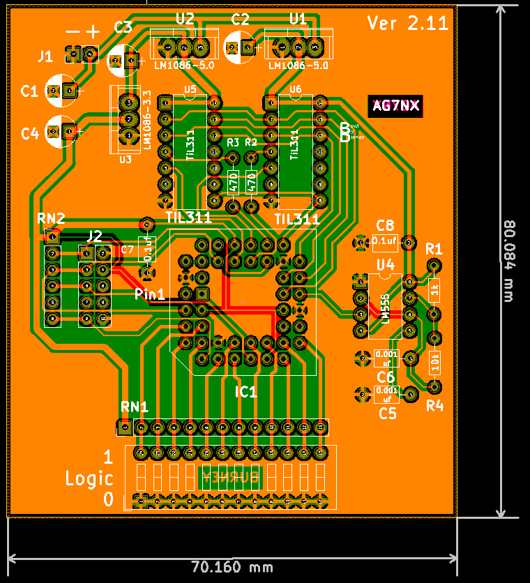
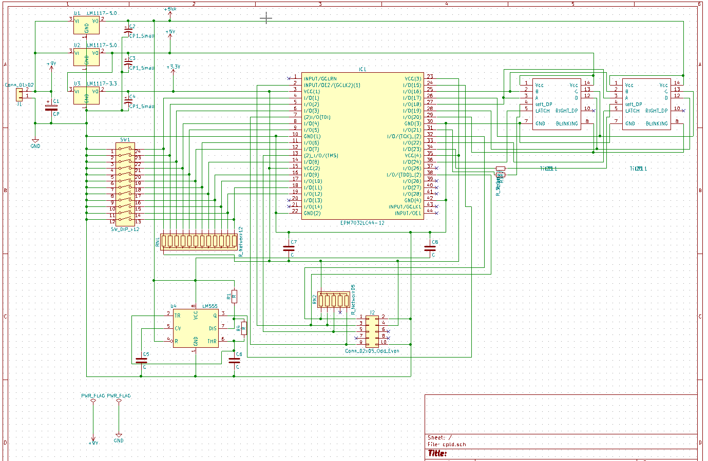

# CPLD Development System

A hand-designed Altera MAX 7000S CPLD development board and the digital labs built on it — from Lake Washington Institute of Technology **Electronics 211** (2017–2018), by **James Burney (K9DTV)**.

This repository packs the PCB design, fabrication outputs, board photos, project write-ups, and a Quartus calculator experiment that targeted the board.

<p align="center">
  
  &nbsp;
  
</p>

<p align="center">
  
  &nbsp;
  
</p>

## What this board is

The goal was a durable **printed** CPLD trainer for the same class work that started on a hand-wired prototype: DIP switches in, dual hexadecimal TIL311-style displays out, on-board clock, and a standard JTAG/ByteBlaster programming header.

Two PCB revisions shipped:

| Version | How to spot it | Notes |
|--------|----------------|--------|
| **Ver1** | No silkscreen | Used for most lab examples in the docs |
| **Ver2** | Has silkscreen | Three display-control pins remapped (see pin table below) |

Power: about **6.5 V–12 V** input (prefer the low end; regulators get hot). Current-limit around **160 mA** when using a bench supply. Drive each display **decimal point with an open-drain** buffer so the DP turns fully off.

Supported CPLDs (PLCC-44):

- **EPM7032** (32 macrocells) — enough for display/switch tests  
- **EPM7064AE** (64 macrocells) — needed for the full calculator project  

The Quartus project in this repo is set for family **MAX7000S**, device **EPM7160SLI84-10** (a larger sibling used while compiling the calculator logic).

## Repository layout

```
.
├── README.md
├── cpld-white.jpg / cpld-green.jpg   # Assembled boards
├── cpld-pcb.png / cpld-sch.png       # Layout / schematic views
├── PCB-files/
│   ├── cpld/                         # KiCad schematic + PCB (legacy KiCad 4 era)
│   └── CLPD-grb/                     # Gerbers + drill for fab
├── calulator/                        # Quartus II project (filename spelling preserved)
├── project docs/                     # Word write-ups (board build, PCB, counter, finals)
└── homework/                         # Class notes (ELEC 211 Ch. 4)
```

Folder and filename spellings (`calulator`, `CLPD-grb`, spaces in `project docs`) match the original archive on purpose.

## Hardware pin map

DIP switches are active-low (closed = logic 0). Most designs invert them in the CPLD so “switch ON” reads as a 1 in the logic.

| Function | Ver1 CPLD pin | Ver2 CPLD pin |
|----------|---------------|---------------|
| DIP SW 1–12 | 4, 5, 6, 8, 9, 12, 11, 14, 16, 17, 19, 18 | same |
| Clock (~66.6 kHz from 555) | 24 | 24 |
| Display A / B / C / D | 27 / 25 / 26 / 28 | same |
| Display Blank | 29 | 29 |
| Right Latch | **31** | **33** |
| Left Latch | **33** | **36** |
| Right DP | 34 | 34 |
| Left DP | **36** | **31** |

Programming-header pins follow the usual Altera JTAG layout (not duplicated in the table).

### Major bill of materials (either revision)

| Ref | Part | Notes |
|-----|------|--------|
| IC1 | EPM7032 or EPM7064AE, PLCC-44 | 64 MC for full calculator |
| U1–U2 | LM1117-5.0 | 5 V rails |
| U3 | LM1117-3.3 | CPLD I/O / core as wired |
| U4 | LM555 | ~66.6 kHz board clock |
| U5–U6 | TIL311 (or DIS1417) | Hex displays (hard to source; eBay) |
| SW1 | 12-position DIP slide | Active-low inputs |
| RN1 / RN2 | 10 kΩ SIP arrays | Pull-ups |
| J2 | 2×5 header | Programming |

Full Digi-Key / Mouser part numbers are in `project docs/pcb document and cpld project.docx`.

## Labs and example designs

Documented in `project docs/`:

1. **Board bring-up** — display blank/latch behavior, 555 clock divider blinking both DPs (~1 Hz after ÷65536).  
2. **Priority encoder** — exercises all DIP switches into the hex displays (BCD).  
3. **Calculator** (needs **64 MC** device) — mode select on SW11/SW12:
   - SW11=0, SW12=0 → **min/max** (7485-style compare; DPs show a swap)
   - SW11=0, SW12=1 → **add**
   - SW11=1, SW12=1 → **subtract** (borrow aware)
   - SW11=1, SW12=0 → **multiply**
4. **Two-digit counter** — final-style exercise on the same pinout (`two digit counter cpld project.docx`).
5. **Hand-wired prototype** — earlier 7000-series socket board used for Ch. 4 / Ch. 7 (`211 build board.docx`).

## Quartus project (`calulator/`)

Intel/Altera **Quartus II** project created around March 2018 (Lite / Web edition era). Top entity name: `calulator`.

Block diagrams referenced by the `.qsf` (add/sub, multiplier, min/max, muxes, hex display) originally lived beside the project on the author’s desktop. Those `.bdf` sources are **not** all present in this archive — only the Quartus project shell, `db/`, and `output_files/` reports are. A recent map attempt fails because those schematic sources are missing; treat this folder as historical project metadata unless you restore the BDFs.

Suggested tools: **Quartus II 13.0 SP1** (or the 17.1 Lite build noted in the `.qsf` header) with a USB-Blaster.

## KiCad / fabrication (`PCB-files/`)

- `PCB-files/cpld/` — schematic (`.sch`), board (`.kicad_pcb`), netlist, project (KiCad 4-style `.pro`).  
- `PCB-files/CLPD-grb/` — Gerber layers (F/B Cu, mask, silk, edge cuts) and `cpld.drl`.

Open with a modern KiCad via the legacy importer, or send the Gerbers straight to a fab.

## Documentation (`project docs/`)

| File | Contents |
|------|----------|
| `211 build board.docx` | Hand-wired prototype + Ch. 7 calculator path |
| `pcb document and cpld project.docx` | Ver1/Ver2 PCB, pin map, BOM, calculator labs |
| `two digit counter cpld project.docx` | Counter lab on the PCB |
| `211 PROJECT.docx` / `211 final.docx` | Course project / final write-ups |

Course context: **Lake Washington Institute of Technology**, Electronics 211, instructor **Professor Peter Welty**.

## License / provenance

Personal educational hardware and reports by James Burney (K9DTV). Course homework notes in `homework/` are included as archived class material. Altera/Intel tool output remains under their respective license terms.

Site / contact: [k9dtv.com](https://k9dtv.com) · GitHub: [K9DTV](https://github.com/K9DTV)

---

*Archived from the original CPLD development-system materials (2017–2018) and published as a public K9DTV project.*